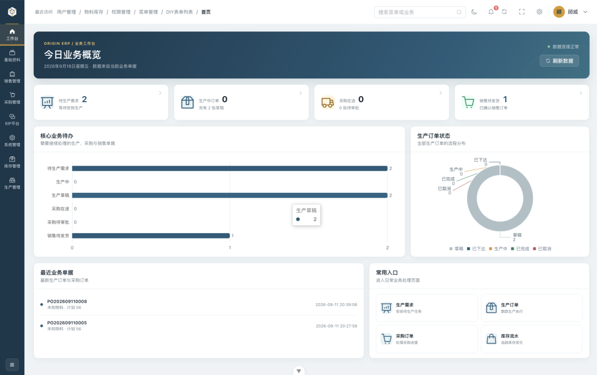
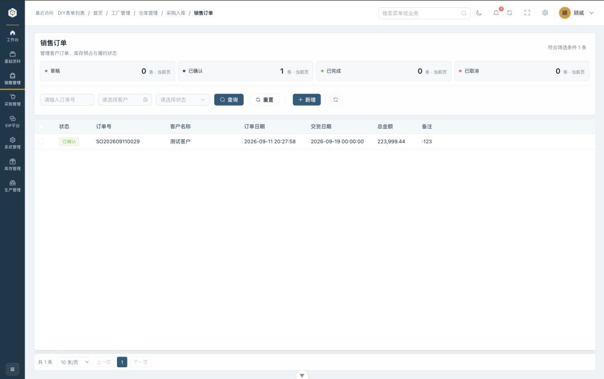
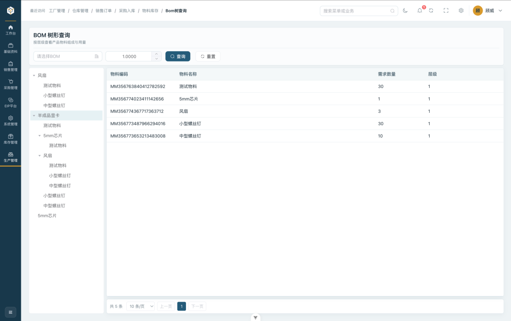
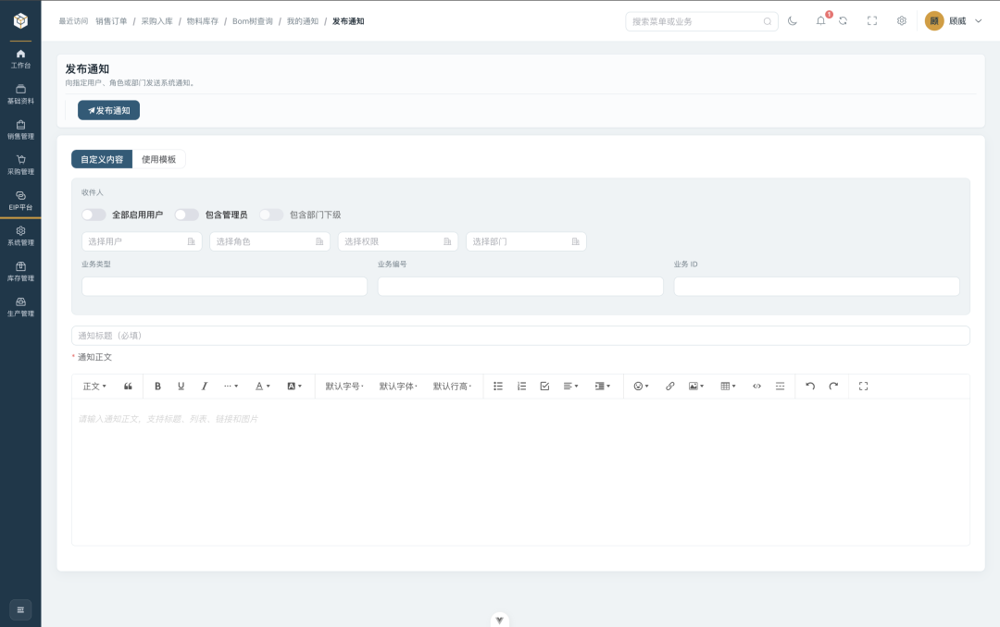
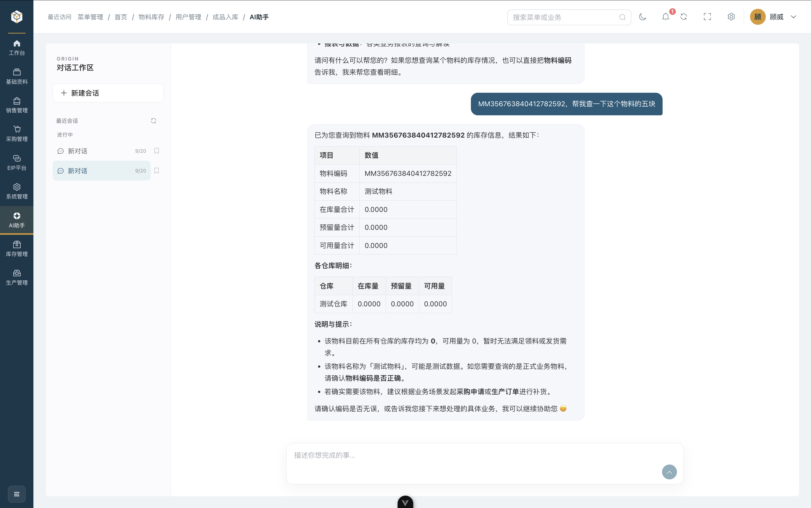

<div align="center">
  <h1>ORIGIN ERP Service</h1>

  <p>面向制造企业的 ERP 后端服务，以可配置权限、可追溯库存和跨业务单据协同为核心。</p>

  <p>
    
    
    
    
    
    <a href="./LICENSE"></a>
  </p>
</div>

## 项目简介

ORIGIN ERP Service 是原点 ERP 的统一业务后端。项目采用 Spring Boot 模块化单体架构，按系统、基础资料、销售、库存、生产（含 BOM）和采购划分业务边界，并以消息通知打通跨模块协同；通过 JWT、RBAC、事务、库存流水和状态机式业务校验保障系统安全与数据一致性。

配套项目：

- [ORIGIN ERP Web](https://github.com/weigu2700-cell/ORIGIN-ERP--FrontEnd)
- [ORIGIN ERP 移动端](https://github.com/weigu2700-cell/ORIGIN-ERP-Moblie)

## 项目亮点

- **模块化单体架构**：保留单体部署和事务的一致性优势，同时按业务域隔离 Controller、Service、Mapper 和模型。
- **RBAC 双层权限**：菜单控制页面入口，Permission 控制接口操作，支持角色、部门、菜单和操作权限组合配置。
- **制造业务闭环**：销售需求可驱动生产，生产订单基于 BOM 计算净需求，缺料衔接采购，出入库同步库存。
- **库存全程可追溯**：统一维护在库量、预留量和可用量，关键库存变化写入流水。
- **明确的单据状态流转**：订单确认、审核、下达、开工、完工、取消和上架均在服务端验证前置状态。
- **多级 BOM 能力**：支持 BOM 版本管理、启用/停用、递归展开和按生产数量计算物料需求。
- **全链路缓存**：基于 Redis 的旁路缓存（Cache-Aside），BOM 展开查询优先命中缓存，显著降低多级 BOM 递归查询的数据库压力，并在 BOM 激活/停用时主动失效。
- **移动作业复用同一后端**：Web 与移动端共享账户、权限、业务数据和统一响应协议。
- **持久化实时通知**：通知先写入数据库，再通过带 JWT 握手认证的 WebSocket 推送；离线用户重新登录后仍可查询未读消息。
- **开箱即用的接口文档**：通过 Springdoc OpenAPI 提供 Swagger UI，便于联调和接口验收。
- **AI 业务助手**：基于 Spring AI 接入 DeepSeek，支持多轮对话与工具调用（如按物料编码聚合各仓库库存），并以当前登录用户身份受 RBAC 约束。

## 业务能力

| 业务域   | 主要能力                                                       |
| -------- | -------------------------------------------------------------- |
| 系统管理 | 登录认证、用户/角色/部门管理、菜单与权限分配                    |
| 基础资料 | 客户、供应商、物料、仓库与工厂/车间/产线主数据                  |
| 销售管理 | 销售订单、库存预留、销售出库与状态流转                          |
| 库存管理 | 在库/预留/可用量、库存流水、Excel 导入导出                      |
| BOM 管理 | BOM 版本与多级展开、基于生产数量的物料净需求计算                |
| 生产管理 | 生产需求、生产订单、下达/开工/完工/取消与生产领料               |
| 采购管理 | 采购需求、采购订单、采购入库审核与上架                          |
| 消息通知 | 通知落库、实时推送、未读统计与单条/全部已读                      |
| AI 助手  | 基于 Spring AI 的对话助手，支持工具调用查询库存等 ERP 业务数据  |

## 业务链路

```text
销售订单
   │
   ├── 库存充足 ──→ 库存预留 ──→ 销售出库 ──→ 库存流水
   │
   └── 库存不足 ──→ 生产需求 ──→ 生产订单 ──→ BOM 净需求
                                          │
                                          ├── 库存领料
                                          └── 采购需求 ──→ 采购订单 ──→ 入库审核/上架
```

库存口径：

```text
可用量 = 在库量 - 预留量
```

## 界面展示

<table>
  <tr>
    <td width="50%" align="center"></td>
    <td width="50%" align="center"></td>
  </tr>
  <tr>
    <td align="center"><b>业务工作台</b>：核心待办与生产订单状态总览</td>
    <td align="center"><b>销售订单</b>：订单状态管理与库存预留</td>
  </tr>
  <tr>
    <td width="50%" align="center"></td>
    <td width="50%" align="center"></td>
  </tr>
  <tr>
    <td align="center"><b>BOM 树形查询</b>：多级 BOM 递归展开与净需求</td>
    <td align="center"><b>发布通知</b>：按用户/角色/部门定向推送通知</td>
  </tr>
</table>

<div align="center">
  
  <p><em>AI 助手 — 自然语言查询物料库存并展示库存明细与业务提示</em></p>
</div>

## 技术栈

| 分类       | 技术                           |
| ---------- | ------------------------------ |
| 运行环境   | Java 21                        |
| 核心框架   | Spring Boot 4.1.0              |
| Web 与校验 | Spring Web、Jakarta Validation |
| 认证授权   | Spring Security、JJWT 0.12     |
| 数据访问   | MyBatis-Plus 3.5               |
| 数据库     | MySQL 8.x                      |
| 缓存与单号 | Spring Data Redis、Redisson    |
| 实时通信   | Spring WebSocket               |
| 接口文档   | Springdoc OpenAPI 2.8          |
| AI 能力    | Spring AI 2.0（OpenAI 兼容协议，接入 DeepSeek 大模型） |
| Excel      | FastExcel                      |
| 构建工具   | Maven Wrapper                  |

## 缓存设计

系统采用 **Cache-Aside（旁路缓存）** 模式，以 Redis 作为集中缓存，目标是减少读多写少场景（尤其是多级 BOM 递归展开）对数据库的重复查询。

### BOM 缓存

BOM 展开是典型的高读压力场景：一次展开可能递归数十个节点，每个节点都要查询 BOM 头与 BOM 明细。为此引入物料级 active BOM 缓存。

- **缓存键**：`erp:bom:hot:{materialId}`
- **缓存值**：`BOMCacheDto`，包含 BOM 头字段与 `BOMItemCacheDto` 明细列表，代表某物料当前 `ACTIVE` 版本（version 最大）的 BOM。
- **TTL**：正常 BOM 120-150 分钟（随机抖动，避免缓存雪崩），空哨兵 5-10 分钟。

读取流程（由 `BOMRedis#getOrLoad` 统一负责，Service 只提供 DB loader）：

```text
1. 查 Redis（key = `erp:bom:hot:{materialId}`）
   ├── 命中 BOMCacheDto → 直接返回
   ├── 命中 EMPTY → 返回 null（空值缓存 TTL 5~10 分钟）
   └── 未命中/历史脏类型
        2. 用 Redisson 锁 `erp:lock:bom:build:{materialId}` 双检
        3. 查 DB：取该物料 status=ACTIVE 且 version 最大的 BOM 及明细
        4. 正常值缓存 120~150 分钟；无 BOM 写入 EMPTY 空值缓存
        5. 返回 BOMCacheDto 或 null
```

`BOMController` 的 BOM 展开（`getBOMExplosion`）及递归 `buildExplosionChildren` 均通过该入口取数，树中公共子件（如 A→B→D 与 A→C→D 的 D）第二次起直接命中缓存。

### 失效策略（写时失效）

旁路缓存必须保证写入后缓存不脏读，因此在 BOM 状态变更时主动删除缓存键：

| 操作     | 触发方法     | 缓存动作                                  |
| -------- | ------------ | ----------------------------------------- |
| 激活 BOM | `activeBOM`  | 事务提交后 `evictAfterCommit(materialId)` |
| 停用 BOM | `disableBOM` | 事务提交后 `evictAfterCommit(materialId)` |
| 新增明细 | `addBOMItem` | 事务提交后 `evictAfterCommit(materialId)` |
| 新增 BOM | `addBOM`     | 不影响（新增为 DRAFT，不参与缓存）        |

### 已知权衡

- **缓存穿透**：不存在 active BOM 的采购件 / 原材料写入 `EMPTY` 空值标记，短 TTL 降低递归展开中的重复回源。
- **提交一致性**：BOM 写路径仅在数据库事务 `afterCommit` 后失效缓存；事务回滚不会误删旧缓存，删除失败只记录日志，不反向影响已提交事务。
- **TTL 兜底**：极端情况下（如缓存删除失败）最多 2 小时内读到旧值，依赖 TTL 自动过期保证最终一致。

发货单状态锁同样使用 Redisson watchdog（`erp:lock:sales-delivery:{id}`），在事务完成后释放。库存入库使用数据库唯一键
`uk_material_warehouse_id` 配合 MySQL `INSERT ... ON DUPLICATE KEY UPDATE` 原子累加；这条 SQL 路径同时覆盖首次并发入库和既有库存增量，流水在同事务回查后的库存上计算。

## 快速开始

### 环境要求

- JDK 21
- MySQL 8.x
- Redis 6+
- Git

项目已包含 Maven Wrapper，无需额外安装 Maven。

### 获取代码

```bash
git clone https://github.com/weigu2700-cell/ORIGIN-ERP-BackEnd.git
cd ORIGIN-ERP-BackEnd
```

### 初始化数据库

1. 创建数据库 `smart-erp`。
2. 按模块执行 `sql/smart-erp/` 下的系统、基础资料和业务表 DDL。
3. 根据目标版本检查并执行 `sql/migrations/` 下的增量脚本。
4. 初始化用户、角色、菜单、权限及其关联数据。仓库不提供可用于生产的默认账号或密码。
5. 消息通知功能依赖 `sys_notification`、`sys_notification_publish`、`sys_notification_template` 和
   `sys_notification_template_recipient` 表，实体与转换逻辑位于 `eip/entity` 和 `eip/converter`。
   首次部署或已有库升级均执行 `sql/migrations/V20260918__eip_notification_expand.sql`；脚本可重复执行。

数据库、Redis 和 JWT 默认配置位于 `src/main/resources/application.yaml`。本地可直接按文件中的开发配置启动；共享、测试和生产环境应使用环境变量或外部配置覆盖，禁止沿用仓库中的开发凭据。

```bash
export SPRING_DATASOURCE_URL='jdbc:mysql://localhost:3306/smart-erp?useUnicode=true&characterEncoding=utf8&serverTimezone=Asia/Shanghai&useSSL=false&allowPublicKeyRetrieval=true'
export SPRING_DATASOURCE_USERNAME='root'
export SPRING_DATASOURCE_PASSWORD='<local-database-password>'
# 生成一次后存入密钥管理系统；不要每次启动都重新生成
openssl rand -base64 32
export JWT_SECRET='<base64-secret-from-previous-command>'
```

Spring Boot 会通过环境变量的宽松绑定将上述 `SPRING_DATASOURCE_*` 配置映射到 `spring.datasource.*`。

常用配置项：

| 配置                                                       | 默认值                                     | 说明                            |
| ---------------------------------------------------------- | ------------------------------------------ | ------------------------------- |
| `spring.datasource.url`                                    | `jdbc:mysql://localhost:3306/smart-erp...` | MySQL 连接地址                  |
| `spring.datasource.username`                               | `root`                                     | MySQL 用户名                    |
| `spring.datasource.password`                               | 本地开发值                                 | 生产环境必须覆盖                |
| `spring.data.redis.host`                                   | `127.0.0.1`                                | Redis 地址                      |
| `spring.data.redis.port`                                   | `6379`                                     | Redis 端口                      |
| `security.jwt.secret` / `JWT_SECRET`                       | 开发密钥                                   | Base64 编码，解码后至少 32 字节 |
| `security.jwt.expiration-millis` / `JWT_EXPIRATION_MILLIS` | `18000000`                                 | Token 有效期，默认 5 小时       |

`JWT_SECRET` 必须是 Base64 编码且解码后至少 32 字节。可选的 `JWT_EXPIRATION_MILLIS` 默认为 `18000000`（5 小时）。

### 启动服务

macOS / Linux：

```bash
./mvnw spring-boot:run
```

Windows：

```powershell
./mvnw.cmd spring-boot:run
```

> 前置依赖：本地需运行 Redis（默认 `127.0.0.1:6379`）；AI 助手需配置大模型密钥，例如：
> `AI_API_KEY=sk-xxx ./mvnw spring-boot:run`（当前接入 DeepSeek，模型名见 `application.yaml` 的 `spring.ai.openai`）。

默认服务地址：<http://localhost:8080>

Swagger UI：<http://localhost:8080/swagger-ui.html>

OpenAPI JSON：<http://localhost:8080/v3/api-docs>

## 认证与响应

登录成功后，客户端在受保护请求中携带 JWT：

```http
Authorization: Bearer <token>
```

接口使用统一响应结构：

```json
{
  "code": 200,
  "msg": "请求成功",
  "data": {}
}
```

权限模型：

```text
User ── UserRole ── Role ── RoleMenu ── Menu
                       └──── RolePermission ── Permission
```

## 消息通知与 WebSocket

### 全链路流程

```text
业务状态流转成功
      │
      ▼
eip.service.NotificationPublisher.publish(NotificationPublishDTO) 发布业务事件
      │
      ▼
原业务事务提交成功（回滚则不发送）
      │
      ▼
eip.listener.NotificationPublishEventListener
      │
      ├── 指定用户：仅通知该用户
      └── 权限编码：解析启用角色、启用用户，并由管理员兜底
      │
      ▼
写入 sys_notification（独立事务，isRead=false）
      │
      ▼
通知事务提交后，由现有 WebSocketSessionManager 定向推送
      │
      ├── 在线：发送 TextMessage
      └── 离线：保留数据库记录，登录后通过 REST 拉取
```

业务模块只依赖 `eip.service.NotificationPublisher` 和 DTO，不直接依赖通知表、权限表或 WebSocket。
发布事件在原业务事务中产生，监听器在 `AFTER_COMMIT` 阶段解析收件人，再以独立事务写入发布批次和收件箱；
收件箱事务提交后才尝试 WebSocket 推送。推送失败只记录警告，不回滚业务数据或已经持久化的通知。

每次发布以 `requestId` 作为批次幂等键，业务通知默认生成
`BUSINESS:{businessType}:{businessId}`；同一批次通过 `(publish_id, user_id)` 保证每位收件人只有一条收件箱记录。
不同业务阶段使用不同 `businessType`，因此“报工待审批”“报工审批通过”和“报工驳回”可以分别通知。

### 已接入的业务节点

| 业务节点 | 收件人规则 | 通知后的动作 |
| -------- | ---------- | ------------ |
| 生产需求已自动排产 | 拥有生产订单下达权限的用户 | 审核并下达生产订单 |
| 采购需求创建 | 拥有采购需求审批权限的用户 | 审批采购需求 |
| 采购需求审批通过 | 拥有采购订单新增或编辑权限的用户 | 创建或更新采购订单 |
| 采购入库单创建 | 拥有采购入库审批权限的用户 | 审批入库单 |
| 采购入库审批通过 | 拥有采购入库上架权限的用户 | 完成上架 |
| 生产领料单备料完成或审批通过 | 拥有领料确认权限的用户 | 确认领料 |
| 生产报工提交 | 拥有报工审批权限的用户 | 审批报工单 |
| 生产报工审批通过或驳回 | 报工人本人 | 查看审批结果 |
| 报工完成并生成成品入库单 | 拥有成品入库操作权限的用户 | 审批成品入库单 |
| 销售发货单确认 | 拥有销售出库完成权限的用户 | 完成销售出库 |

### 建立连接与认证

WebSocket 端点为：

```text
ws://localhost:8080/ws/notification?token=<JWT>
```

HTTPS 环境使用：

```text
wss://api.example.com/ws/notification?token=<JWT>
```

握手流程：

1. `/ws/**` 在 Spring Security HTTP 过滤链中放行，使请求可以完成协议升级。
2. `WebSocketAuthInterceptor` 从 `token` 查询参数读取 JWT，并调用现有 `JwtUtil` 校验。
3. 校验成功后将 `userId` 写入 WebSocket session attributes；校验失败直接拒绝握手。
4. `NotificationWebSocketHandler` 建立连接时注册用户会话，关闭时精确移除同一会话。
5. `WebSocketSessionManager` 使用线程安全 Map 保存当前在线连接，并按 `userId` 定向发送文本消息。

当前实现支持同一账号多浏览器、多设备同时在线：会话以 `Map<Long, Set<WebSocketSession>>` 按用户聚合，新连接追加而非替换旧连接；推送时遍历该用户全部活动会话，单会话推送失败仅移除该失效会话并继续其余会话，保证其他设备正常接收。

JWT 位于 WebSocket URL 查询参数中。生产环境必须使用 WSS，并避免在反向代理访问日志、APM 或错误页中记录完整查询字符串。

### REST API

所有 REST 接口都基于 `CurrentUser` 限定当前用户数据。详情查询和已读操作不会访问其他用户的通知。

| 方法  | 地址                             | 说明                                                      |
| ----- | -------------------------------- | --------------------------------------------------------- |
| `GET` | `/sys/notification`              | 分页查询通知，参数为 `pageNum`、`pageSize`、可选 `isRead` |
| `GET` | `/sys/notification/{id}`         | 查询当前用户的一条通知详情                                |
| `GET` | `/sys/notification/unread/count` | 查询当前用户未读数量                                      |
| `PUT` | `/sys/notification/{id}/readed`  | 将当前用户指定通知标记为已读                              |
| `PUT` | `/sys/notification/all/readed`   | 将当前用户全部未读通知标记为已读                          |

通知类型：

| 编码 | 枚举       | 含义       |
| ---- | ---------- | ---------- |
| `0`  | `SYSTEM`   | 系统消息   |
| `1`  | `BUSINESS` | 业务消息   |
| `2`  | `WARNING`  | 预警消息   |
| `3`  | `TASK`     | 任务消息   |
| `4`  | `CUSTOM`   | 自定义消息 |

WebSocket 推送内容与通知详情字段保持一致，示例：

```json
{
  "id": "9007199254740993",
  "userId": "10001",
  "type": 1,
  "title": "销售订单已确认",
  "content": "销售订单 SO-001 已完成确认，请及时处理后续业务。",
  "businessType": "sales_order",
  "businessId": "20001",
  "businessNo": "SO-001",
  "isRead": false,
  "readTime": null,
  "createTime": "2026-09-17 08:00:00",
  "updateTime": "2026-09-17 08:00:00"
}
```

`Long` 类型 ID 返回给 JavaScript 客户端时应保持字符串形式，避免超过 `Number.MAX_SAFE_INTEGER` 后产生精度损失。

### 在业务中发送通知

业务 Service 注入 `NotificationPublisher`，用 `NotificationBusinessRefDTO` 表达业务引用，
用 `RecipientSelectorDTO` 表达收件人选择：

```java
NotificationPublishDTO publish = NotificationPublishDTO.business(
        NotificationType.TASK,
        "待审批采购需求",
        "采购需求 PR-001 已创建，请及时审批。",
        NotificationBusinessRefDTO.of(
                "PURCHASE_DEMAND_PENDING_APPROVAL", demandId, "PR-001"),
        RecipientSelectorDTO.permissions(
                Set.of("purchase:demand:approve"), true));
notificationPublisher.publish(publish);
```

发布时也可以直接选择用户（例如报工审批结果）：设置 `recipients.userIds`，并保持
`includeAdministrators=false`，因此不会扩散给管理员。权限选择会解析启用角色和启用用户，
`includeAdministrators=true` 时额外覆盖启用管理员。系统通知可通过 `/eip/notification-templates`
提前配置模板和收件人；发布接口 `/eip/notifications/publish` 支持 PRESET_ONLY、MERGE、OVERRIDE
策略，分别表示仅模板收件人、模板与手选收件人合并、手选收件人覆盖模板。
不使用模板直接发布时，默认使用本次手选收件人；调用方可传入稳定 `requestId` 防止重复提交。

业务模块不应直接操作 `NotificationPersistenceService` 或 `WebSocketSessionManager`，统一通过单参数
`NotificationPublisher#publish` 保持“业务提交、通知落库、实时推送”的顺序和故障隔离。

## AI 助手

AI 助手基于 Spring AI 2.0（OpenAI 兼容协议，当前接入 DeepSeek 大模型）构建，以对话方式帮助业务人员查询库存、解读单据与经营指标。它不是一个独立账号，而是**以当前登录用户的身份**调用后端业务方法，因此受与前端完全一致的 RBAC 约束。

### 能力概览

- **多轮对话**：Spring AI 的 JDBC `ChatMemory` 按 `conversationId` 维护模型上下文；`ai_conversation` / `ai_message` 则保存前端可见的对话和消息历史（建表脚本见 `sql/migrations/V20260922__ai_conversation_history.sql`）。
- **工具调用（Tool Calling）**：模型可在生成过程中调用业务工具查询真实数据。已接入库存（`get_material_stock` 按物料编码聚合各仓库在库/预留/可用量）、销售（`query_sales_orders` / `query_sales_deliveries`）、生产（`query_production_orders` / `query_production_demands`）、采购（`query_purchase_demands` / `query_purchase_orders`）与通知（`query_my_notifications`）等只读查询工具，并以当前登录用户身份受 RBAC 约束。
- **流式与非流式**：提供一次性返回与 SSE 逐字流式返回两种模式，前端可边生成边渲染。
- **对话与消息管理**：创建、查看、归档对话与拉取历史消息，均按当前用户归属隔离。

### 接口

| 方法    | 地址                                    | 说明                                    |
| ------- | --------------------------------------- | --------------------------------------- |
| `POST`  | `/ai/assistant/chat`                    | 非流式对话                              |
| `POST`  | `/ai/assistant/chat/stream`             | 流式对话（SSE，响应 `text/event-stream`）|
| `POST`  | `/ai/conversation`                      | 创建对话，返回 `conversationId`         |
| `GET`   | `/ai/conversation`                      | 当前用户的对话列表                      |
| `GET`   | `/ai/conversation/{conversationId}`     | 获取指定对话（归属校验）                |
| `PUT`   | `/ai/conversation/{conversationId}/archive` | 归档对话                            |
| `GET`   | `/ai/message/{conversationId}`          | 拉取某对话的历史消息                    |

对话入参 `AiAssistantRequest`：

```json
{
  "conversationId": 10001,
  "message": "查一下物料 A-1001 在各仓库的库存情况"
}
```

流式接口返回 `Flux<AiAssistantStreamResult>`（内容、标题或错误事件）；非流式返回 `Result<AiAssistantResult>`。

模块包结构与依赖规则见 [AI 模块结构](docs/ai-architecture.md)。

### 鉴权模型

- 所有 AI 接口同样需要 `Authorization: Bearer <token>`。
- 助手以当前登录用户身份执行。工具调用走的是 `MaterialStockService.pageMaterialStock()`，该方法带有 `@PreAuthorize("hasAnyAuthority('inventory:material-stock:list')")`，因此用户必须拥有相应权限工具才会成功，否则返回无权限错误。
- 对话与消息按 `userId` 归属隔离：`getOwnedConversation` 会校验对话所属用户与当前用户一致，越权访问返回 403，确保用户之间无法互看或篡改对话。

### 配置

AI 配置位于 `application.yaml` 的 `spring.ai` 段，敏感项建议用环境变量覆盖：

| 配置                                        | 环境变量                        | 说明                                                  |
| ------------------------------------------- | ------------------------------- | ----------------------------------------------------- |
| `spring.ai.openai.api-key`                  | `AI_API_KEY`                    | 大模型 API Key（当前为 DeepSeek）                     |
| `spring.ai.model.embedding`                 | `AI_EMBEDDING_MODEL`            | 默认 `none`，RAG 尚未接入聊天                          |
| `spring.ai.openai.embedding.api-key`       | `AI_EMBEDDING_API_KEY`          | 预留的嵌入模型密钥                                    |
| `spring.ai.openai.base-url`                 | —                               | 服务地址，当前 `https://api.deepseek.com`             |
| `spring.ai.chat.options.model`              | `SPRING_AI_CHAT_OPTIONS_MODEL`  | 模型名，须为服务支持的值（如 `deepseek-flash`、`deepseek-v4-pro`）|
| `spring.ai.chat.memory.repository.jdbc.initialize-schema` | —                | `always` 时自动建对话记忆表                           |

> 模型名必须以大模型服务实际支持的值为准。若启动或调用时返回 “supported API model names are ...” 之类错误，说明传入的模型名不被支持，改为 `deepseek-flash` 或 `deepseek-v4-pro` 等受支持的值即可。

## 项目结构

```text
src/main/java/org/smart/erp/
├── common/       # 响应、异常、安全、WebSocket、配置、序号、Excel 和通用工具
├── ai/           # AI 助手：controller、request、result、service、persistence、config、tool、rag
├── system/       # 用户、角色、部门、菜单、权限和认证
├── eip/          # 通知实体、DTO、收件人解析、持久化与 WebSocket 适配
│   ├── entity/ dto/ mapper/ service/ (service/impl/)
│   ├── controller/ converter/ event/ listener/ adapter/ port/
│   └── enums/ vo/
├── master/       # 客户、供应商、工厂、车间、产线、仓库和物料
├── inventory/    # 物料库存与库存流水
├── sales/        # 销售订单与销售出库
├── production/   # BOM、生产需求、生产订单和生产领料
└── purchase/     # 采购需求、采购订单和采购入库

sql/smart-erp/
├── sys_*.sql              # 系统与权限表
├── md_*.sql               # 基础资料表
├── inv_*.sql              # 库存表
├── sal_*.sql              # 销售表
├── prd_*.sql              # BOM 与生产表
├── pur_*.sql              # 采购表
├── permission_init.sql    # 权限初始化
└── seed_dev_admin.sql     # 本地开发管理员数据
```

每个业务模块通常包含：

```text
controller → dto → service → mapper → entity / vo
```

## 构建与验证

```bash
# 编译
./mvnw clean compile

# 运行测试
./mvnw test

# 打包
./mvnw clean package
```

测试集使用 Testcontainers + MySQL 8.4 验证首次并发入库。Docker 可用时会自动运行该集成测试；
未安装或未启动 Docker 时自动跳过，不阻断其余单元测试。CI 应提供 Docker 环境，避免将该并发测试跳过。

构建产物位于 `target/`。

## 开发规范

- Controller 负责参数校验、权限声明和统一响应，核心业务逻辑放在 Service。
- 跨表写操作使用事务，订单与库存变化必须保持原子性。
- 状态切换必须校验当前状态，禁止客户端绕过业务流程。
- 实体主键使用 `Long`；传给 JavaScript 客户端时按字符串处理。
- 枚举通过 MyBatis-Plus 映射数据库值，避免散落的魔法数字。
- 新增字段时同步更新实体、DTO、VO、Mapper 查询和 SQL 脚本。
- 新增或修改接口时同步维护 OpenAPI 注解和客户端类型。

## 生产部署建议

- 使用环境变量或配置中心管理数据库、Redis 和 JWT 配置。
- 不要在仓库中提交生产密码、私钥或访问令牌。
- 在反向代理层启用 HTTPS、请求大小限制和访问日志。
- 为 `/ws/notification` 配置 WebSocket 协议升级、合理的空闲超时和 WSS；不要记录带 JWT 的完整查询字符串。
- 对数据库执行定期备份，并对库存、订单等核心表保留审计能力。
- 部署前执行完整测试和打包，确认目标环境使用 JDK 21。

## 未来计划

以下能力处于规划阶段，尚未落地：

- **通知能力扩展**：增加自动重连、心跳、多设备会话、消息模板和更多业务事件接入。
- **AI 能力扩展**：多轮对话与只读业务查询已落地。后续可规划知识库与需用户确认的业务操作。
- **零代码表单建设**：提供可视化表单设计器，支持动态字段、校验与联动规则配置，并能基于业务单据自动生成录入页与列表页，为 DIY/低代码场景预留扩展能力。

## 参与贡献

1. Fork 仓库并创建功能分支：`git checkout -b feature/your-feature`
2. 完成功能并执行 `./mvnw test`
3. 使用清晰的提交信息，例如：`feat: add production picking approval`
4. 推送分支并创建 Pull Request，说明业务规则、数据影响和验证方式

问题与建议请提交到 [GitHub Issues](https://github.com/weigu2700-cell/ORIGIN-ERP-BackEnd/issues)。

## 许可证

本项目基于 [MIT License](./LICENSE) 开源。
